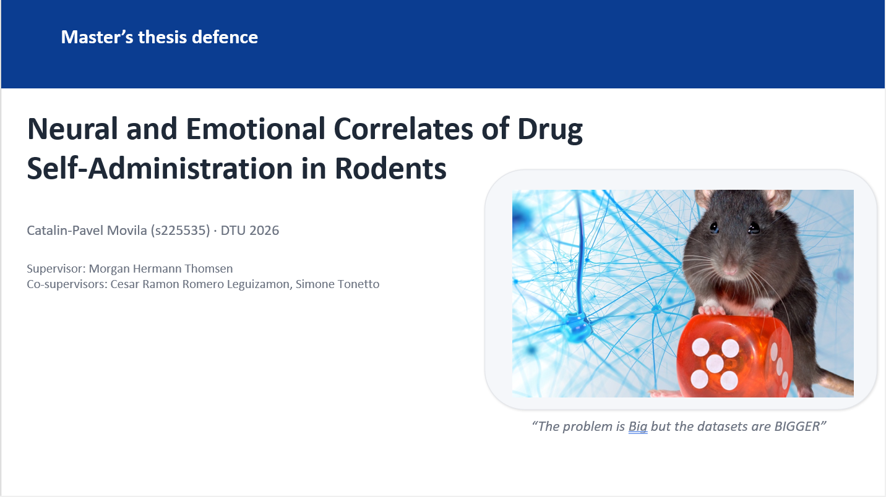

# NeuroSync
# Multimodal Session Sync — FP · TTL · USV

A compact GUI for bringing **fiber photometry (FP)**, **behavioral logs (TTLBox)**, and **ultrasonic vocalizations (USVs)** onto a single, shared **session timeline**.

  

## What’s in this repository
- **GUI entrypoint** for running the pipeline and inspecting results at session scale
- **Step-wise processing modules** (signal correction, synchronization, USV timeline shift)
- **Viewers** for full-session browsing + event inspection
- **Export utilities**

## Synchronization algorithm
**Affine Timebase Mapping (ATM)**

The synchronization workflow is based on an affine timebase mapping approach used to align session-level data streams recorded on different timelines.

  

  <em>Click the preview to open the full presentation.</em>

  

